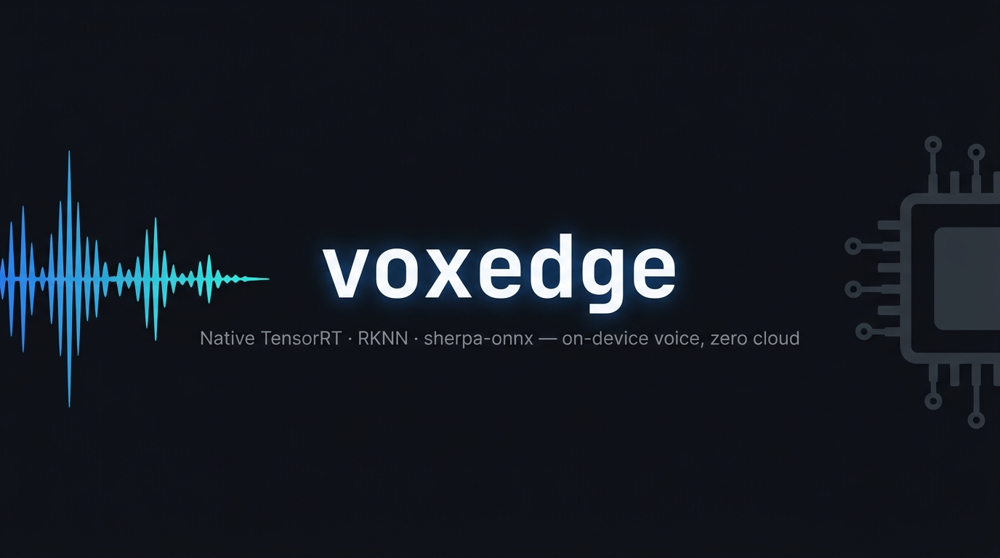

# voxedge

> **English** | [中文](README.zh-CN.md)

<p align="center">
  
</p>

[](https://pypi.org/project/voxedge)
[](LICENSE)
[](https://pypi.org/project/voxedge)

**Native TensorRT · RKNN · sherpa-onnx voice pipelines for Jetson, Rockchip, and Raspberry Pi — fully on-device, verified on real hardware, zero cloud.**

<!-- TODO: Add demo GIF — recommend a ~15s terminal recording showing ASR→TTS on Jetson Orin (place in media/demo.gif) -->

## What is voxedge?

voxedge is an embeddable Python library that drives real-time, on-device voice conversations by calling directly into each platform's native inference runtime — TensorRT on Jetson Orin, RKNN on RK3576/RK3588, sherpa-onnx on CPU. No cloud STT/TTS APIs, no internet at runtime, no intermediate abstraction overhead. The same `ConversationEngine` contract spans the three backend families; the exact model/runtime configuration still determines which features and concurrency level are available.

voxedge is the open-core engine behind **[OpenVoiceStream](https://github.com/suharvest/openvoicestream)** — the deployable FastAPI/WebSocket server, device profiles, and agent gallery. Want a container? Start there. Want to embed real-time edge voice in your own app? You're in the right place.

## Key Features

- **Native runtimes, full performance** — calls directly into TensorRT (Jetson), RKNN (Rockchip), and sherpa-onnx (CPU); no wrapper overhead, no cross-platform abstraction tax
- **Fully on-device** — no speech API key, no per-call bill, no internet dependency at runtime
- **Hardware evidence, narrowly scoped** — selected Jetson slot-pool configurations have passed N=2 smoke tests on Orin Nano 8 GB; this is not a blanket N=2 guarantee for every backend, model, device, or artifact build
- **Streaming + barge-in** — partial + final ASR while the user speaks; sentence-level TTS streaming with first-audio latency low enough for live dialogue and cooperative barge-in
- **Swap hardware, not code** — same `ConversationEngine` API across Jetson, Rockchip, and sherpa-onnx CPU; only the backend constructor changes
- **Test on any machine** — mock backends require only numpy; the whole engine runs end-to-end on a Mac with no CUDA or GPU

## Quickstart

Runs on any machine — no GPU needed. Swap the backend constructors for a real device; the engine, transport, and event contract never change.

```bash
pip install voxedge
```

```python
import asyncio
from voxedge.engine import ConversationEngine
from voxedge.transport import InProcessTransport
from voxedge.backends.mock import MockASR, MockTTS, MockVAD

engine = ConversationEngine(
    backends={"asr": MockASR(transcript="hello world"), "tts": MockTTS(), "vad": MockVAD()},
    multi_utterance=True,
)

async def main():
    t = InProcessTransport()
    await t.feed_audio(b"\x01\x02" * 8000)   # speech frames (int16 PCM)
    await t.feed_audio(b"\x00\x00" * 8000)   # silence → VAD endpoints the utterance
    t.end_input()
    await engine.run(t)                       # drives ASR → (LLM) → TTS
    for ev in t.drain_events_nowait():        # asr_final / tts_* / ...
        print(ev["type"], ev.get("text", ""))

asyncio.run(main())
```

On a real device, swap **only the backend constructors** — everything else is identical:

```python
# Jetson Orin — pip install voxedge[jetson]
from voxedge.backends.jetson import (
    TRTEdgeLLMASRBackend, TRTEdgeLLMASRConfig,
    TRTEdgeLLMTTSBackend, TRTEdgeLLMTTSConfig,
)

engine = ConversationEngine(backends={
    "asr": TRTEdgeLLMASRBackend(TRTEdgeLLMASRConfig(...)),   # Qwen3-ASR, native TRT
    "tts": TRTEdgeLLMTTSBackend(TRTEdgeLLMTTSConfig(...)),   # Qwen3-TTS, streaming
}, multi_utterance=True)
```

> `import voxedge` is **numpy-only** — TensorRT, RKNN, and sherpa-onnx are lazy-imported by their backend adapters and pulled in via extras. The example above imports cleanly on a Mac even though the TRT engine only runs on a Jetson.

## Install

```bash
pip install voxedge            # pure-Python core (numpy only)
pip install voxedge[sherpa]    # sherpa-onnx CPU ASR/TTS
pip install voxedge[jetson]    # Jetson TensorRT backends (aarch64)
pip install voxedge[rk]        # Rockchip RK3576/RK3588 NPU (aarch64)
pip install voxedge[llm]       # OpenAI-compatible LLM backend (httpx)
```

The `jetson` extra installs only Python-side dependencies available from the package index. It does **not** install TensorRT/CUDA, the C++/pybind workers, plugins, TensorRT engines, or model artifacts; those come from JetPack and the engine/artifact release. Therefore `pip install voxedge[jetson]` alone does not produce a runnable Jetson deployment. The same platform-runtime caveat applies to RKNN and `voxedge[rk]`.

## Library versus server

voxedge is a Python library: backend interfaces, the conversation engine, and in-process/websocket transport adapters. It does not start FastAPI or expose HTTP routes. **OpenVoiceStream (OVS)** is the deployable server/product layer that selects profiles, owns artifacts and containers, and exposes network APIs.

OVS provides an OpenAI-compatible speech surface including:

- `POST /v1/audio/speech` — audio is streamed with HTTP chunked transfer rather than buffered into one response;
- `GET /v1/models` — models available from that OVS deployment;
- `GET /v1/capabilities` — runtime/backend capabilities detected by that deployment.

These routes describe OVS, not endpoints implemented by this repository.

## Architecture

Four layers, all importable without CUDA.

### Backends (`voxedge/backends/`)

Clean ABCs in `backends/base.py` — every constructor takes explicit params only, no env coupling:

- `ASRBackend` / `ASRStream` — streaming recognition
- `TTSBackend` — `synthesize()` (batch) + `generate_streaming()` (sentence-level chunks, cooperative cancel via `cancel_token` for barge-in)
- `VADBackend` / `VADSession` — voice-activity detection for speech / barge-in segmentation
- `LLMBackend` / `LLMEvent` — token-streaming LLM for the conversation loop

Concrete adapters live under `backends/{jetson,rk,sherpa}/` and import their heavy runtimes **lazily** (inside methods), so all modules import on any machine:

| Backend | Platform | Models | Extra | Source engine |
|---------|----------|--------|-------|---------------|
| `backends/jetson/` | Jetson Orin (TensorRT) | Qwen3-ASR/TTS, Matcha, Kokoro, Paraformer, SenseVoice, MOSS-TTS-Nano | `voxedge[jetson]` aarch64 | [jetson-voice-engine](https://github.com/suharvest/qwen3-edgellm-jetson) |
| `backends/rk/` | Rockchip RK3576/RK3588 (RKNN) | Qwen3-ASR, Matcha, Piper, Kokoro, Paraformer, SenseVoice | `voxedge[rk]` aarch64 | [rkvoice-stream](https://github.com/suharvest/rkvoice-stream) |
| `backends/sherpa/` | CPU (any arch) | Paraformer, Zipformer, SenseVoice, Matcha, Kokoro ONNX | `voxedge[sherpa]` | — |
| `backends/llm/` | Any | OpenAI-compatible LLM over httpx | `voxedge[llm]` | — |
| `backends/mock.py` | Dev / CI | MockASR, MockTTS, MockVAD, MockLLM | core | — |

### Jetson TTS voice, clone, and speed matrix

| Model/backend | Voice selection | Voice cloning / enrollment | Speed behavior |
|---|---|---|---|
| Matcha TRT | Fixed/single model voice | No cloning | Native continuous speed (`length_scale`) |
| Qwen3-TTS Base | Speaker embedding; an optional configured fixed base embedding may be the default | Consumes reusable embeddings; reference-WAV enrollment is available only when the speaker-encoder artifact is present | Continuous speed through the numpy DSP fallback |
| Qwen3-TTS CustomVoice | Built-in named speakers | No external voice cloning or enrollment | Continuous speed through the numpy DSP fallback |
| MOSS-TTS-Nano | Reference audio conditions each request | Prompt-prefix cloning from reference audio; no reusable speaker-embedding API | Continuous speed through the numpy DSP fallback |
| SparkTTS | Controllable gender/pitch/speed **style labels** | Registry-based clone voices only when `voices_dir` is configured; selection uses an enrolled `voice_id` | Discrete speed labels are native; continuous factors use the DSP fallback |

"DSP fallback" means voxedge post-processes PCM; it is not a native model control and may have different quality/latency characteristics.

### Transport (`voxedge/transport/`)

`Transport` ABC + two implementations:

- `InProcessTransport` — zero-IPC asyncio queues; default, used everywhere in tests
- `WebSocketTransport` — duck-typed ws adapter with no FastAPI dependency; idle-watchdog timeout injected by caller, reads no env

### Conversation Engine (`voxedge/engine/`)

`ConversationEngine` + per-connection `Session` coordinator, split into focused collaborators: `audio_dispatcher` (VAD → speech / barge-in), `asr_loop`, `client_events`, `tts_sequencer` / `tts_buffer`, `session_state`, and the LLM↔tool loop — `llm_turn` over the provider-agnostic `turn_driver.run_turn` pump, with `tool_registry` (`@tool` → JSON schema) and `coordinator` / `concurrency_capability` for multi-stream concurrency.

### Capabilities (`voxedge/capabilities/`)

Optional, default-off, stateless add-ons (punctuation, speaker embedding) via sherpa-onnx. Opt in explicitly; byte-level no-op when off.

## Design Constraints

- **Pure Python core** — `import voxedge` is numpy-only. Heavy adapters live under `backends/{jetson,rk,sherpa}/` with deferred runtime imports.
- **Explicit runtime config** — backend configuration is injected as params; profiles and deployment knobs belong to [OpenVoiceStream](https://github.com/suharvest/openvoicestream). The optional artifact downloader deliberately honors `HF_ENDPOINT` after an explicit endpoint and before the manifest endpoint.

## Status

This source tree reports voxedge **0.0.6a1**. The current OVS production line remains pinned to voxedge **0.0.5a0** until the 0.0.6a1 runtime image passes target-device qualification. In particular, the OpenAI HTTP routes above are OVS behavior, not a voxedge compatibility promise. The mock-based suite runs without CUDA, but it does not replace target-device validation.

## Contributing

Issues and PRs welcome. The mock backend suite runs on any machine with no hardware:

```bash
pip install voxedge
uv run pytest
```

## Ecosystem

voxedge is one layer in a family of repos:

| Repo | Role | When to go there |
|------|------|-----------------|
| **voxedge** *(this repo)* | Embeddable Python engine | Embedding real-time voice in your own app |
| [openvoicestream](https://github.com/suharvest/openvoicestream) | Deployable FastAPI/WebSocket server, Docker profiles, agent gallery | Deployed use-cases and end-to-end demos; ready-to-run containers |
| [rkvoice-stream](https://github.com/suharvest/rkvoice-stream) | Rockchip NPU engine (`backends/rk/` wraps this) | RK3576/RK3588 model formats, RKNN perf numbers, TTS/ASR backend internals |
| [jetson-voice-engine](https://github.com/suharvest/qwen3-edgellm-jetson) | Jetson TensorRT build scripts, model export, artifacts (`backends/jetson/` wraps this) | Jetson model conversion, TRT engine build, Orin-specific optimisations |

## Acknowledgements

- [sherpa-onnx](https://github.com/k2-fsa/sherpa-onnx) — CPU ASR/TTS runtime
- [OpenVoiceStream](https://github.com/suharvest/openvoicestream) — the deployable server product built on this engine

## License

Apache-2.0. See [LICENSE](LICENSE).
