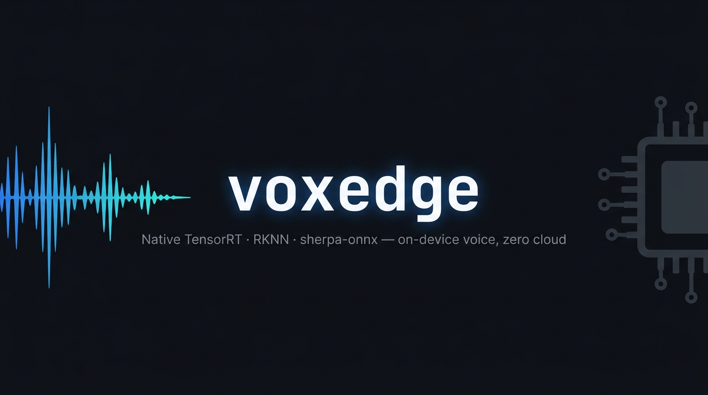

# voxedge

> [English](README.md) | **中文**

<p align="center">
  
</p>

[](https://pypi.org/project/voxedge)
[](LICENSE)
[](https://pypi.org/project/voxedge)

**原生 TensorRT · RKNN · sherpa-onnx 语音流水线，适配 Jetson、瑞芯微与树莓派 —— 完全离线，在真实硬件上验证，零云依赖。**

<!-- TODO: 添加演示 GIF —— 建议录制约 15 秒的终端视频，展示 Jetson Orin 上的 ASR→TTS 流程（存放至 media/demo.gif）-->

## voxedge 是什么？

voxedge 是一个可嵌入的 Python 库，通过直接调用各平台原生推理运行时来驱动实时、端侧语音对话 —— Jetson Orin 上是 TensorRT，RK3576/RK3588 上是 RKNN，CPU 上是 sherpa-onnx。无需云端 STT/TTS API，运行时不依赖网络，没有中间抽象层的性能损耗。同一套 `ConversationEngine` API 可跨三套后端运行，只需替换构造器 —— 已在 Orin Nano 8 GB 上验证 N=2 并发会话，输出逐字节一致，零 CUDA 错误。

voxedge 是已上线产品 **[OpenVoiceStream](https://github.com/suharvest/openvoicestream)** 的开源内核（产品侧含 FastAPI/WebSocket 服务、设备 profile、部署工具与 agent 库）。想要可部署的容器？从那里开始。想把实时边缘语音嵌进自己的应用？这里就是对的地方。

## 核心特性

- **原生运行时，充分发挥性能** —— 直接调用 TensorRT（Jetson）、RKNN（瑞芯微）、sherpa-onnx（CPU），无封装开销，无跨平台抽象损耗
- **完全离线** —— 无需语音 API key，无按次计费，运行时不依赖网络
- **在真实硬件上验证** —— Orin Nano 8 GB 实测 N=2 并发会话：与单路输出逐字节一致，零 CUDA 错误
- **流式 + 打断（barge-in）** —— 用户说话时即出 partial + final ASR；句级 TTS 流式输出，首音延迟低到足以支撑实时对话与协作式打断
- **换硬件，不换代码** —— 同一套 `ConversationEngine` API 横跨 Jetson、瑞芯微、sherpa-onnx CPU，只需替换后端构造器
- **任何机器均可测试** —— mock 后端只依赖 numpy；整个引擎在无 CUDA、无 GPU 的 Mac 上即可端到端运行

## 快速上手

在任意机器上即可运行，无需 GPU。换到真实设备时只替换后端构造器，引擎、传输层、事件契约完全不变。

```bash
pip install voxedge
```

```python
import asyncio
from voxedge.engine import ConversationEngine
from voxedge.transport import InProcessTransport
from voxedge.backends.mock import MockASR, MockTTS, MockVAD

engine = ConversationEngine(
    backends={"asr": MockASR(transcript="hello world"), "tts": MockTTS(), "vad": MockVAD()},
    multi_utterance=True,
)

async def main():
    t = InProcessTransport()
    await t.feed_audio(b"\x01\x02" * 8000)   # 语音帧（int16 PCM）
    await t.feed_audio(b"\x00\x00" * 8000)   # 静音 → VAD 切分出一句话
    t.end_input()
    await engine.run(t)                       # 驱动 ASR → (LLM) → TTS
    for ev in t.drain_events_nowait():        # asr_final / tts_* / ...
        print(ev["type"], ev.get("text", ""))

asyncio.run(main())
```

在真实设备上，只替换**后端构造器**，其余完全不变：

```python
# Jetson Orin —— pip install voxedge[jetson]
from voxedge.backends.jetson import (
    TRTEdgeLLMASRBackend, TRTEdgeLLMASRConfig,
    TRTEdgeLLMTTSBackend, TRTEdgeLLMTTSConfig,
)

engine = ConversationEngine(backends={
    "asr": TRTEdgeLLMASRBackend(TRTEdgeLLMASRConfig(...)),   # Qwen3-ASR，原生 TRT
    "tts": TRTEdgeLLMTTSBackend(TRTEdgeLLMTTSConfig(...)),   # Qwen3-TTS，流式
}, multi_utterance=True)
```

> `import voxedge` **只依赖 numpy** —— TensorRT、RKNN、sherpa-onnx 由各自的后端适配器惰性导入，通过 extras 安装。因此上面的例子在 Mac 上也能干净导入，即便 TRT 引擎只在 Jetson 上真正运行。

## 安装

```bash
pip install voxedge            # 纯 Python 核心（仅 numpy）
pip install voxedge[sherpa]    # sherpa-onnx CPU ASR/TTS
pip install voxedge[jetson]    # Jetson TensorRT 后端（aarch64）
pip install voxedge[rk]        # 瑞芯微 RK3576/RK3588 NPU（aarch64）
pip install voxedge[llm]       # OpenAI 兼容 LLM 后端（httpx）
```

`jetson` / `rk` extras 只声明纯 Python 依赖；CUDA/TensorRT 与 RKNN 运行时 wheel 来自平台（JetPack L4T / 瑞芯微 NPU 用户态）或引擎仓库 —— 平台运行时由你自带。

## 架构

四层，全部无需 CUDA 即可导入。

### 后端（`voxedge/backends/`）

`backends/base.py` 中是干净的 ABC —— 每个构造器只接受显式参数，不耦合 env：

- `ASRBackend` / `ASRStream` —— 流式识别
- `TTSBackend` —— `synthesize()`（整段）+ `generate_streaming()`（句级 chunk，通过 `cancel_token` 协作式取消以支持 barge-in）
- `VADBackend` / `VADSession` —— 切分语音 / 打断的语音活动检测
- `LLMBackend` / `LLMEvent` —— 对话循环用的 token 流式 LLM

具体适配器位于 `backends/{jetson,rk,sherpa}/`，**惰性导入**各自的重型运行时（在方法内部），所以模块在任意机器上都能导入：

| 后端 | 平台 | 模型 | Extra |
|------|------|------|-------|
| `backends/jetson/` | Jetson Orin（TensorRT） | Qwen3-ASR/TTS、Matcha、Kokoro、Paraformer、SenseVoice、MOSS-TTS-Nano | `voxedge[jetson]` aarch64 |
| `backends/rk/` | 瑞芯微 RK3576/RK3588（RKNN） | `rkvoice_stream` 引擎 | `voxedge[rk]` aarch64 |
| `backends/sherpa/` | CPU（任意架构） | Paraformer、Zipformer、SenseVoice、Matcha、Kokoro ONNX | `voxedge[sherpa]` |
| `backends/llm/` | 任意 | OpenAI 兼容 LLM（httpx） | `voxedge[llm]` |
| `backends/mock.py` | 开发 / CI | MockASR、MockTTS、MockVAD、MockLLM | 核心包 |

### 传输层（`voxedge/transport/`）

`Transport` ABC + 两个实现：

- `InProcessTransport` —— 零 IPC 的 asyncio 队列；默认实现，测试中处处使用
- `WebSocketTransport` —— 鸭子类型的 ws 适配器，不依赖 FastAPI；空闲看门狗超时由调用方注入，不读 env

### 对话引擎（`voxedge/engine/`）

`ConversationEngine` + 每连接一个的 `Session` 协调器，拆成聚焦的协作体：`audio_dispatcher`（VAD → 语音 / 打断）、`asr_loop`、`client_events`、`tts_sequencer` / `tts_buffer`、`session_state`，以及 LLM↔工具循环 —— `llm_turn` 跑在与厂商无关的 `turn_driver.run_turn` pump 之上，配 `tool_registry`（`@tool` → JSON schema）与 `coordinator` / `concurrency_capability` 做多路并发。

### Capabilities（`voxedge/capabilities/`）

可选、默认关闭、无状态的附加能力（标点、声纹）走 sherpa-onnx。需显式开启；关闭时为字节级 no-op。

## 设计约束

- **纯 Python 核心** —— `import voxedge` 只依赖 numpy。重型适配器位于 `backends/{jetson,rk,sherpa}/`，运行时导入被推迟。
- **库内不读 env** —— 所有配置以显式参数注入。profile、环境变量、部署开关是产品（[OpenVoiceStream](https://github.com/suharvest/openvoicestream)）的职责，不是引擎的。

## 状态

已上线 —— 一个已发货的边缘语音栈背后的开源内核。约 270 个基于 mock 的测试；整个引擎能在无 CUDA 的 Mac 上端到端运行。

## 参与贡献

欢迎提 Issue 和 PR。mock 后端测试套件在任何机器上无需硬件即可运行：

```bash
pip install voxedge
uv run pytest
```

## 致谢

- [sherpa-onnx](https://github.com/k2-fsa/sherpa-onnx) —— CPU ASR/TTS 运行时
- [OpenVoiceStream](https://github.com/suharvest/openvoicestream) —— 基于本引擎构建的可部署服务端产品

## 许可证

Apache-2.0，详见 [LICENSE](LICENSE)。
